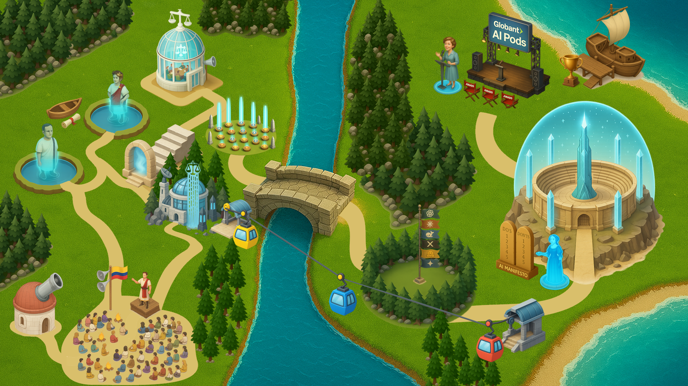

# Welcome!
> 
> **MVP Development Category (Globant, AI PODs Edition)**<br>
> This contest challenges talented individuals to solve problems using software — regardless of programming language or framework —<br>
> by applying the most relevant tools and concepts from the IT industry each year to address real-world issues.

```txt
   _____ ______ _   _             _____  ____  ______ _______ 
  / ____|  ____| \ | |   /\      / ____|/ __ \|  ____|__   __|
 | (___ | |__  |  \| |  /  \    | (___ | |  | | |__     | |   
  \___ \|  __| | . ` | / /\ \    \___ \| |  | |  __|    | |   
  ____) | |____| |\  |/ ____ \   ____) | |__| | |       | |   
 |_____/|______|_| \_/_/    \_\ |_____/ \____/|_|       |_|   
                                                              
```


## 📁 Directory Overview
### `roadmap/`  
This folder contains everything used to create this year’s illustrated competition roadmap — both prompts and generated images.
##### `📁 assets/`  
Includes all the graphical elements added layer by layer until the full visual map was assembled.
##### `📁 avatars/`  
Holds details of the AI-powered assistants (like Quiliano, Ada, Magnus, Eleanor) who guide participants through the experience.
##### `📁 layers/`  
Progressively refined prompts and intermediate images, organized by generation layers.
##### `📁 reference/`  
Hand-drawn sketches, Paint diagrams, and real-world photos used to align the GPT-4o model with the creative direction.
##### `📁 tests/`  
Early concept tests exploring whether AI image generation was viable for a project of this style and scope.
##### `📄 map_prompt.md`  
The initial freeform prompt that inspired the map. Though useful to structure ideas, this version proved too broad for generating the full map at once. It did, however, produce the first rough test renders.
##### `🎨 map_layered.pdn`  
The layered composition file created using [Paint.NET](https://www.getpaint.net/) — a lightweight, free editing tool that allowed stacking and aligning the generated assets.

---
## 🔮 What’s Next
##### `⚙️ chrome_ext/`  
A Chrome extension will serve as the central hub for the competition: featuring access to videos, AI assistants, learning resources, and real-time updates for participants and instructors.
##### `⚙️ talk_flow/`  
A feedback pipeline built with `n8n` to collect participant and instructor insights — from kickoff to final awards — ensuring we stay closely attuned to the learning experience.

---
## ❤️ Creator
Designed by **Felipe Peña** for the "Categoría de Desarrollo Integral" sponsored by [Globant](https://www.globant.com/es).
Connect on [LinkedIn](https://www.linkedin.com/in/fepecas/) or follow on [X / Twitter](https://x.com/fepecas).

_Built with prompts, love, patience and pixels._